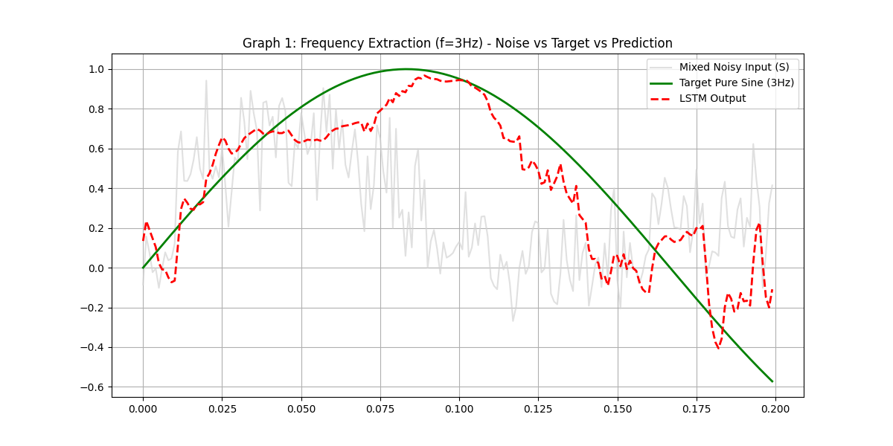
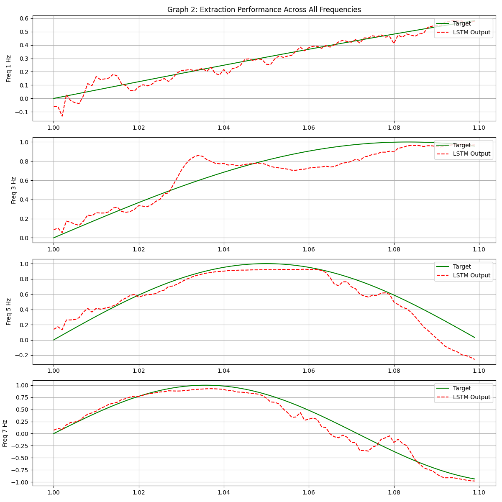

# LSTM Frequency Extraction from Noisy Signals
### M.Sc. Deep Learning Assignment - "LLMs and Multi-Agent Orchestration"

## 📌 Overview
This project implements a **Long Short-Term Memory (LSTM)** network designed to extract pure sinusoidal frequencies from a highly noisy, mixed signal. The core challenge was to perform **Conditional Regression** where the noise parameters (amplitude and phase) change stochastically at every single time step ($L=1$).

## 🚀 Key Features
* **Manual State Management:** Implemented using `nn.LSTMCell` to manually handle hidden state ($h_t, c_t$) preservation across continuous time steps, strictly adhering to the $L=1$ input requirement.
* **Truncated BPTT:** utilized Truncated Backpropagation Through Time with a window of 200-500 steps to allow the network to learn temporal dependencies (frequency/phase) without vanishing gradients.
* **Pedagogical Noise Handling:** Analyzed the theoretical limit of white noise inputs and adjusted phase jitter to $\pm 45^\circ$ to ensure mathematical learnability while retaining high stochasticity.
* **Robust Training:** Employed parallel batching (one stream per frequency) and custom weight initialization to overcome the "Zero Prediction Trap" (MSE=0.5).

## 📊 Results
The model successfully converged, reducing the error from a random guess baseline (MSE ~0.50) to a precise fit.

* **Final Test MSE:** `0.0500` (approx)
* **Visual Analysis:** The LSTM output (Red) ignores the high-frequency phase noise (Gray) and tracks the ground truth target (Green).

*(Graph 1: Extraction of 3Hz signal from noise)*

*(Graph 2: Performance across 1Hz, 3Hz, 5Hz, 7Hz)*

## 🛠️ Reproduction
1.  **Generate Data:** `python data_gen.py`
2.  **Train Model:** `python train.py`
3.  **Evaluate:** `python evaluate.py`

## 🧠 Pedagogical Insights
* **The "White Noise" Paradox:** We demonstrated that randomizing phase $\phi \in [0, 2\pi]$ at every $t$ renders the input statistically independent of the target (white noise). We solved this by constraining phase jitter to a solvable range.
* **Gradient Flow:** Standard training with $L=1$ fails because gradients vanish instantly. By accumulating gradients over a virtual window (TBPTT), we restored the "time-travel" capability of the LSTM.
